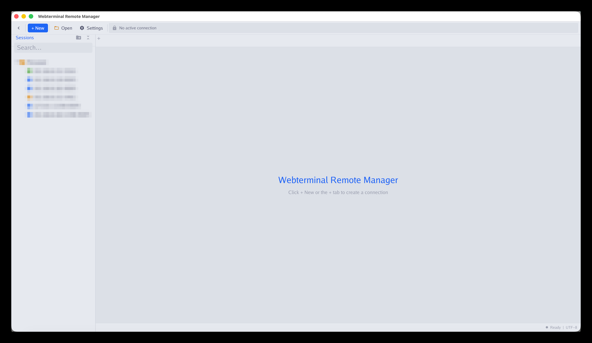
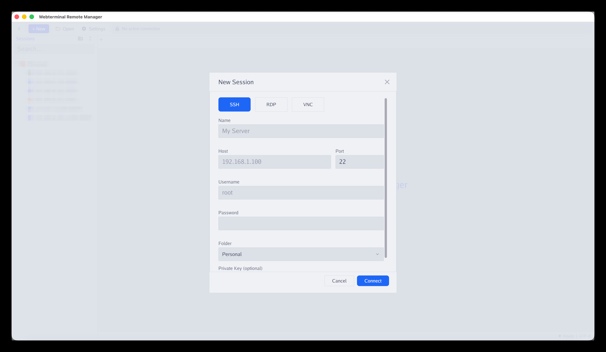
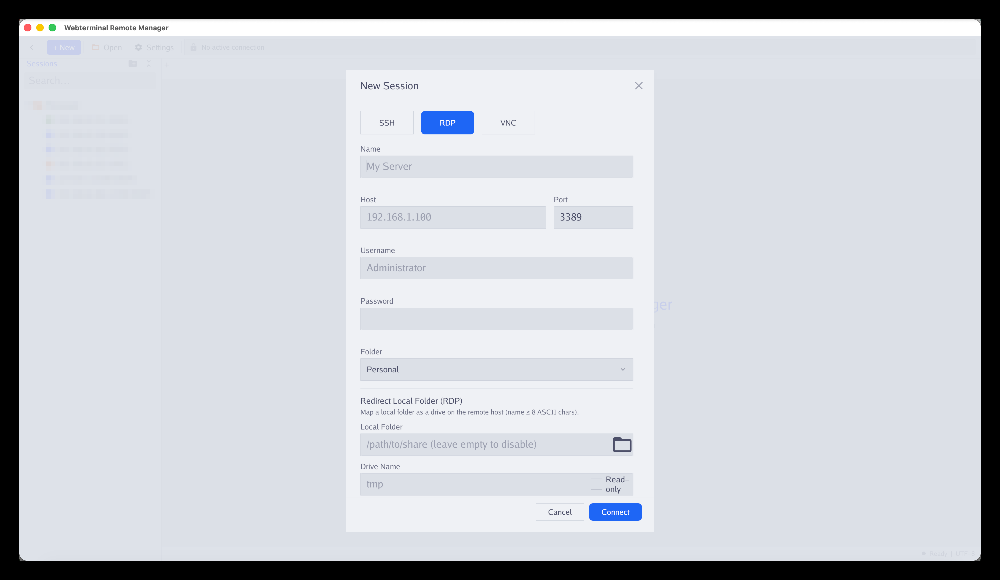
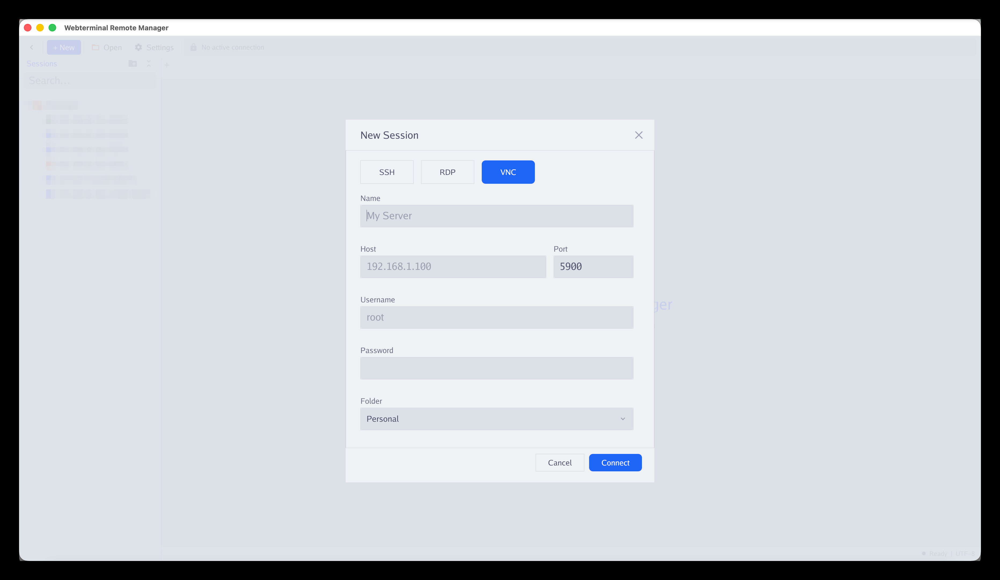
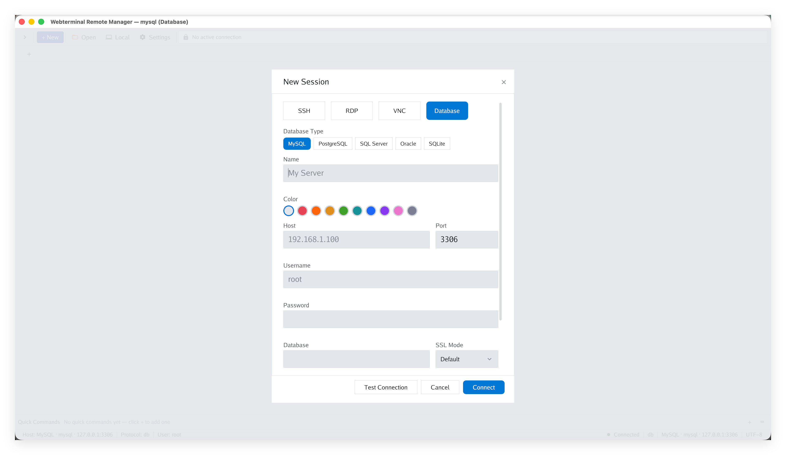
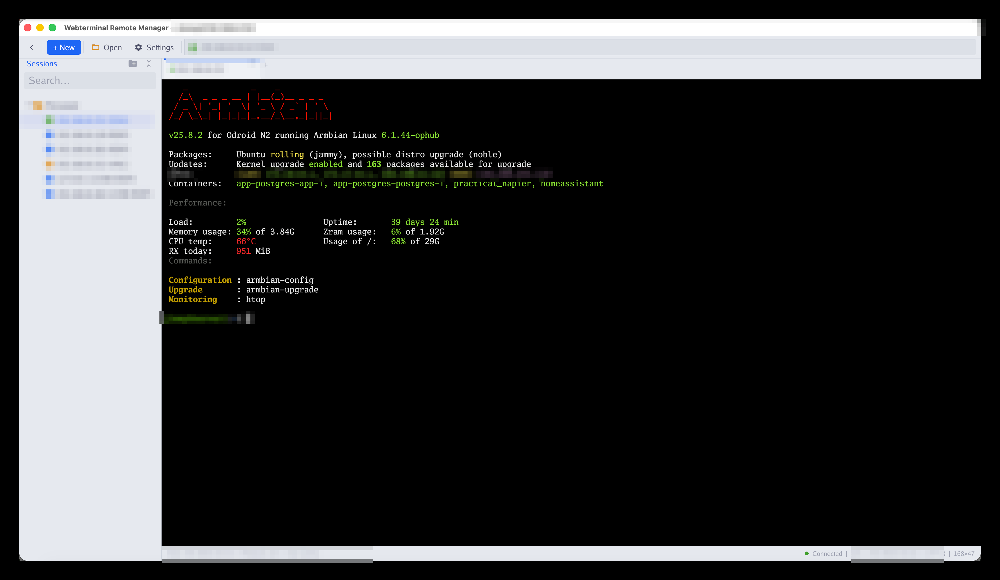
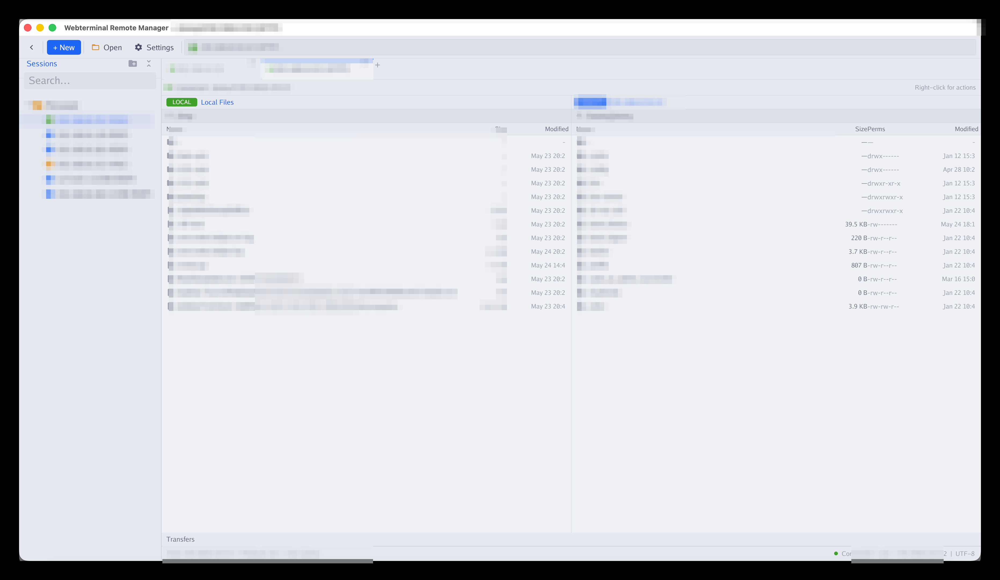
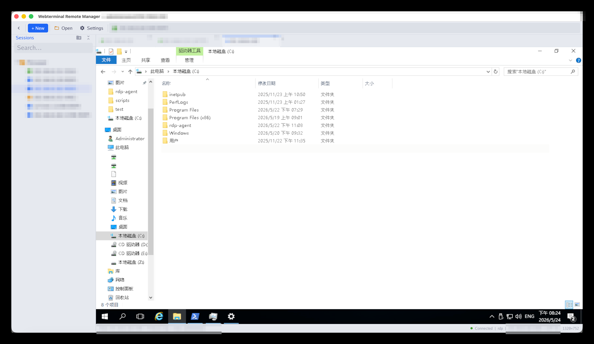
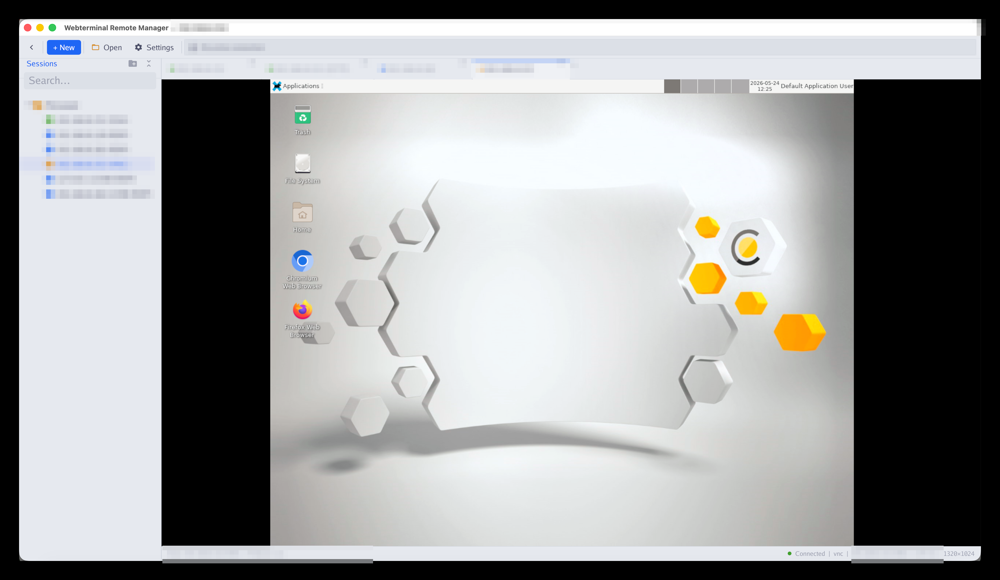
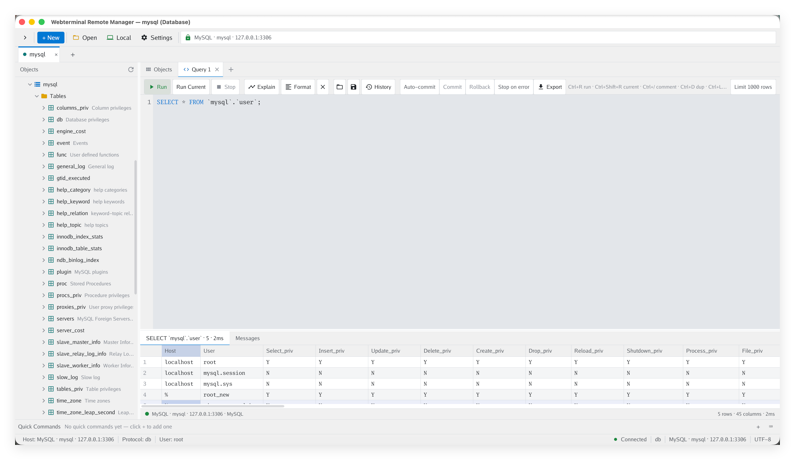

# MTerminal

**[中文说明](README_zh.md)**

MTerminal (Webterminal Remote Manager) is a cross-platform desktop application for managing remote sessions over **SSH**, **RDP**, **VNC**, **SFTP**, and **databases** — all within a single window. Built with [Gio](https://gioui.org) in pure Go, it runs natively on **macOS**, **Linux**, and **Windows** with no external runtime dependencies.

## Download

Pre-built packages are published on the **[Releases](https://github.com/jimmy201602/mterminal/releases)** page:

| Platform | Architecture | Formats |
|----------|-------------|---------|
| **macOS** | Universal (amd64 + arm64) | `.dmg` |
| **macOS** | amd64 / arm64 | `.dmg` |
| **Linux** | amd64 / arm64 | `.deb`, `.rpm`, `.AppImage` |
| **Windows** | amd64 | `-setup.exe`, portable `.exe` |

Installed builds can update themselves in place — check for updates from the app menu (macOS) or the Settings panel.

## Features

- **Multi-protocol** — SSH terminals, RDP desktops, VNC servers, SFTP file browsers, and database workspaces in one app
- **Database client** — Navicat-style workspace for **MySQL**, **PostgreSQL**, **SQL Server**, **Oracle**, and **SQLite**: object tree, multiple query editors, table data viewers, and table designers; TLS modes, read-only enforcement, and SSH-tunnel connections supported
- **Tabbed interface** — run many sessions side by side and switch instantly
- **Session manager** — save, group, and search sessions in a folder-organized sidebar
- **Local shell** — a built-in local terminal (ConPTY on Windows 10 1809+, automatic fallback on older systems)
- **SFTP file browser** — dual-pane local/remote file manager with drag-and-drop transfers
- **RDP drive redirection** — map a local folder into the remote Windows host as a shared drive (read-write or read-only)
- **CLI launch** — open sessions straight from the command line for scripting and automation
- **Single-instance IPC** — later CLI invocations fold into the running window
- **Self-update** — in-app update checks with an optional mirror feed when GitHub is unreachable
- **i18n** — English and Chinese UI with automatic locale detection

## Screenshots

### Main Window



### New Session

| SSH | RDP | VNC | Database |
|:---:|:---:|:---:|:---:|
|  |  |  |  |

### SSH Terminal



### SFTP File Browser



### RDP Remote Desktop



### VNC Remote Desktop



### Database Workspace

Object tree, query editors, table data, and table designer — MySQL, PostgreSQL, SQL Server, Oracle, and SQLite:



## Usage

Launch without arguments to open the graphical session manager:

```bash
mterminal
```

Or start a session directly from the command line:

```bash
# SSH
mterminal -protocol ssh -host 192.168.1.100 -user root -password 'pwd'

# RDP
mterminal -protocol rdp -host 192.168.1.100 -user Administrator -password 'pwd'

# VNC
mterminal -protocol vnc -host 192.168.1.100 -port 5900 -password 'pwd'

# SFTP
mterminal -protocol sftp -host 192.168.1.100 -user root -password 'pwd'

# Database (mysql | postgres | sqlserver | oracle | sqlite)
mterminal -protocol mysql -host 192.168.1.100 -user root -password 'pwd' -db-name appdb
mterminal -protocol sqlite -db-file /path/to/app.db
```

Use the `PASSWORD` environment variable to avoid exposing credentials in process listings:

```bash
PASSWORD='s3cr3t' mterminal -protocol ssh -host 192.168.1.100 -user root
```

## License

Proprietary — distributed as binary releases only.
