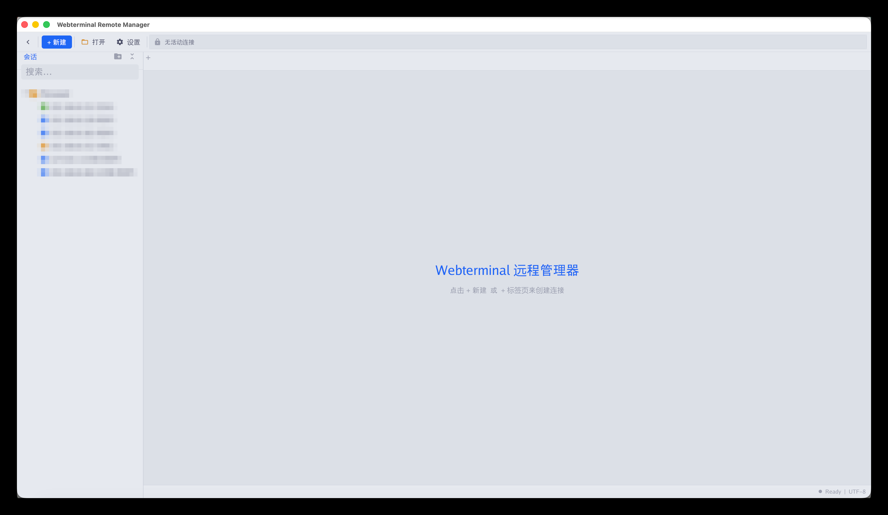
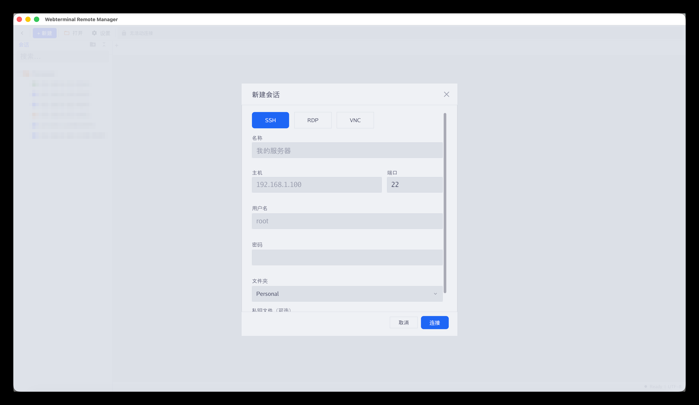

# MTerminal

**[English](README.md)**

MTerminal（Webterminal 远程管理器）是一款跨平台桌面应用，在单个窗口内统一管理 **SSH**、**RDP**、**VNC**、**SFTP** 和**数据库**远程会话。基于 [Gio](https://gioui.org) 使用纯 Go 构建，原生运行于 **macOS**、**Linux** 和 **Windows**，无需额外运行时依赖。

## 下载

预构建安装包发布在 **[Releases](https://github.com/jimmy201602/mterminal/releases)** 页面：

| 平台 | 架构 | 格式 |
|------|------|------|
| **macOS** | Universal (amd64 + arm64) | `.dmg` |
| **macOS** | amd64 / arm64 | `.dmg` |
| **Linux** | amd64 / arm64 | `.deb`、`.rpm`、`.AppImage` |
| **Windows** | amd64 | `-setup.exe`、便携 `.exe` |

已安装的版本支持应用内自更新——从 macOS 应用菜单或设置面板检查更新即可。

## 功能特性

- **多协议** — SSH 终端、RDP 远程桌面、VNC 服务器、SFTP 文件浏览器和数据库工作区合一
- **数据库客户端** — Navicat 风格工作区，支持 **MySQL**、**PostgreSQL**、**SQL Server**、**Oracle**、**SQLite**：对象树、多查询编辑器、表数据查看和表设计器；支持 TLS 模式、只读强制和 SSH 隧道连接
- **标签页界面** — 多会话并行，即时切换
- **会话管理** — 侧栏按文件夹分组保存、整理和搜索会话
- **本地终端** — 内置本地 shell（Windows 10 1809+ 使用 ConPTY，更老系统自动降级为管道模式）
- **SFTP 文件管理器** — 双栏本地/远程文件管理，支持拖拽传输
- **RDP 驱动器重定向** — 将本地文件夹映射到远程 Windows 主机（读写或只读）
- **命令行启动** — 直接通过命令行拉起会话，便于脚本与自动化
- **单实例 IPC** — 后续命令行调用合并进已运行的窗口
- **自更新** — 应用内检查更新，GitHub 不可达时可配置镜像源兜底
- **国际化** — 中英文界面，自动识别系统语言

## 界面截图

### 主窗口



### 新建会话



数据库会话支持 MySQL、PostgreSQL、SQL Server、Oracle、SQLite：


### SSH 终端


### SFTP 文件浏览器


### RDP 远程桌面


### VNC 远程桌面


### 数据库工作区

对象树、查询编辑器、表数据查看和表设计器——支持 MySQL、PostgreSQL、SQL Server、Oracle、SQLite：


## 使用方法

不带参数启动即打开图形界面会话管理器：

```bash
mterminal
```

也可以从命令行直接发起会话：

```bash
# SSH
mterminal -protocol ssh -host 192.168.1.100 -user root -password 'pwd'

# RDP
mterminal -protocol rdp -host 192.168.1.100 -user Administrator -password 'pwd'

# VNC
mterminal -protocol vnc -host 192.168.1.100 -port 5900 -password 'pwd'

# SFTP
mterminal -protocol sftp -host 192.168.1.100 -user root -password 'pwd'

# 数据库（mysql | postgres | sqlserver | oracle | sqlite）
mterminal -protocol mysql -host 192.168.1.100 -user root -password 'pwd' -db-name appdb
mterminal -protocol sqlite -db-file /path/to/app.db
```

使用 `PASSWORD` 环境变量可避免凭据暴露在进程列表中：

```bash
PASSWORD='s3cr3t' mterminal -protocol ssh -host 192.168.1.100 -user root
```

## 许可

专有软件 — 仅以二进制形式发布。
